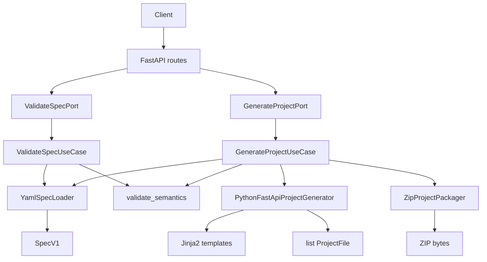
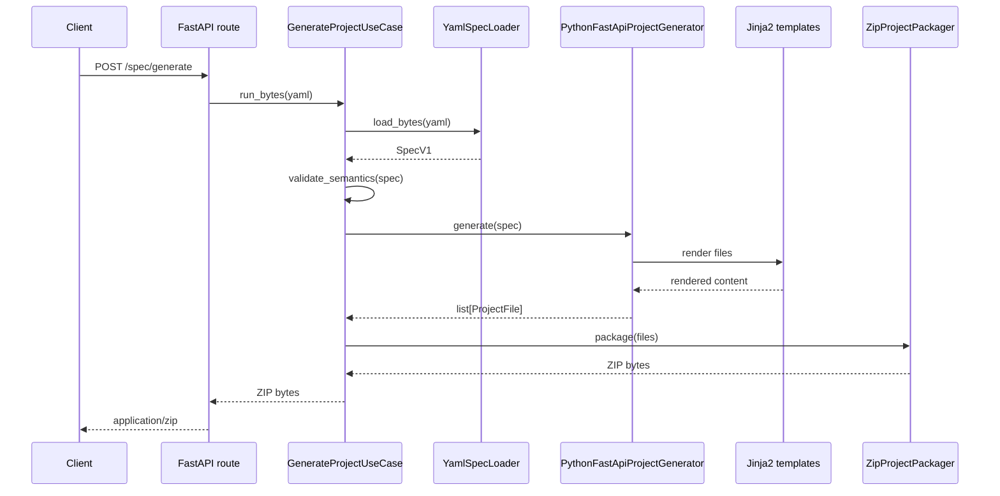

# Microforge

Microforge is a code-generation API.

It receives a YAML specification, validates it, and generates a starter backend project as a ZIP file. The current MVP supports `python + fastapi`.

The project is also a learning playground for:

- Hexagonal architecture.
- DDD-style domain modeling.
- Code generation with templates.
- CI with tests and coverage.

## What It Does Today

Microforge currently exposes two main API flows:

```text
Validate YAML spec
Generate project ZIP from YAML spec
```

The generated project currently includes:

```text
README.md
pyproject.toml
src/<packageName>/main.py
src/<packageName>/domain/models/__init__.py
src/<packageName>/domain/models/<model>.py
```

For the example spec in [examples/spec_valid.yaml](examples/spec_valid.yaml), Microforge generates:

```text
src/orders_service/domain/models/order.py
```

with a Python dataclass for `Order`.

## Example Input

```yaml
specVersion: 1
project:
  name: orders-service
  packageName: orders_service
target:
  language: python
  framework: fastapi
  pythonVersion: "3.12"
  packaging: poetry
service:
  name: orders
  description: Minimal valid spec
api:
  basePath: /api/v1
models:
  - name: Order
    fields:
      - name: id
        type: uuid
      - name: status
        type: string
```

Generated model:

```python
from dataclasses import dataclass

from uuid import UUID


@dataclass
class Order:
    id: UUID
    status: str
```

## API

### Health

```http
GET /api/v1/health
```

Response:

```json
{"status": "ok"}
```

### Validate A Spec

```http
POST /api/v1/spec/validate
Content-Type: multipart/form-data
```

Form field:

```text
file=@examples/spec_valid.yaml
```

Success:

```json
{"ok": true}
```

### Generate A Project

```http
POST /api/v1/spec/generate
Content-Type: multipart/form-data
```

Form field:

```text
file=@examples/spec_valid.yaml
```

Success:

```text
application/zip
```

The response is returned as:

```http
Content-Disposition: attachment; filename="<uploaded-yaml-name>.zip"
```

## Local Usage

Install dependencies:

```bash
uv sync --dev
```

Run the API:

```bash
uv run uvicorn src.main:app --reload
```

Validate a spec:

```bash
curl -X POST \
  -F "file=@examples/spec_valid.yaml;type=application/yaml" \
  http://127.0.0.1:8000/api/v1/spec/validate
```

Generate a project:

```bash
curl -X POST \
  -F "file=@examples/spec_valid.yaml;type=application/yaml" \
  http://127.0.0.1:8000/api/v1/spec/generate \
  --output generated-project.zip
```

Inspect the ZIP:

```bash
unzip -l generated-project.zip
```

Inspect the generated model:

```bash
unzip -p generated-project.zip src/orders_service/domain/models/order.py
```

## Architecture

Microforge uses a pragmatic hexagonal architecture:

```text
src/microforge/
  domain/
  application/
  infrastructure/
```

### Domain

The domain contains Microforge concepts and rules:

```text
domain/spec/
  models.py
  types.py
  errors.py
  semantics.py

domain/generation/
  project_file.py
```

This layer knows about specs, fields, models, semantic validation and generated files.

It does not know about FastAPI, YAML, Jinja2, ZIP files or HTTP.

### Application

The application layer contains ports and use cases:

```text
application/spec/
  ports/
  use_cases/

application/generation/
  ports/
  use_cases/
```

It orchestrates workflows:

```text
load spec -> validate spec
load spec -> validate spec -> generate files -> package ZIP
```

It should stay thin.

### Infrastructure

Infrastructure contains adapters:

```text
infrastructure/inbound/api/
infrastructure/outbound/spec/
infrastructure/outbound/generation/
```

This is where FastAPI, PyYAML, Jinja2 and ZIP packaging live.

Target-specific generation logic also lives here because it depends on language and framework choices.

## Flow



## Generation Flow



## Project Generation Internals

The generator produces a list of `ProjectFile` objects:

```python
ProjectFile(path="src/orders_service/main.py", content=b"...")
```

The ZIP packager turns those files into bytes:

```python
bytes
```

Current generation target:

```text
python + fastapi
```

Current target implementation:

```text
infrastructure/outbound/generation/targets/python/fastapi/
  generator.py
  renderers/
    domain_models.py
  templates/
    README.md.j2
    main.py.j2
    pyproject.toml.j2
    domain/
      model.py.j2
```

## Type Mapping

The current Python model renderer maps Microforge field types to Python types:

| Microforge | Python | Import |
| --- | --- | --- |
| `string` | `str` | none |
| `int` | `int` | none |
| `long` | `int` | none |
| `boolean` | `bool` | none |
| `uuid` | `UUID` | `from uuid import UUID` |
| `decimal` | `Decimal` | `from decimal import Decimal` |
| `instant` | `datetime` | `from datetime import datetime` |
| `date` | `date` | `from datetime import date` |

This mapping is target-specific. Java, Go and other targets should have their own mappings.

## Testing

Run tests:

```bash
uv run pytest
```

Run coverage gate:

```bash
uv run pytest --cov=microforge --cov-report=term-missing --cov-fail-under=80
```

Run lint:

```bash
uv run ruff check .
```

## Adding New Generated Files

There are two common cases.

Static files:

```text
one template -> one output file
```

Example:

```text
main.py.j2 -> src/<packageName>/main.py
```

Per-model files:

```text
one template -> one output file per model
```

Example:

```text
domain/model.py.j2 -> src/<packageName>/domain/models/order.py
```

Avoid creating one renderer class per file unless the file needs special logic. Prefer a small generic rendering path plus context-building functions.

## Adding New Targets

Future examples:

```text
java + spring
go + gin
typescript + nestjs
```

Each target should implement `ProjectGeneratorPort` and return:

```python
list[ProjectFile]
```

When a second target exists, add a registry that resolves a generator from:

```text
spec.target.language
spec.target.framework
```

## Design Rules

- Keep domain independent from frameworks.
- Keep application thin.
- Keep target-specific code generation in infrastructure outbound.
- Keep Jinja2 templates close to the target that owns them.
- Keep type mappings target-specific.
- Test generated paths and important generated content.

## Roadmap

Suggested next steps:

1. Simplify the target folder structure if it starts to feel too deep.
2. Make static template rendering more declarative.
3. Generate Pydantic schemas per model.
4. Generate API routes.
5. Add a target registry before adding Java or Go.
6. Add ORM generation after domain models and schemas are stable.
